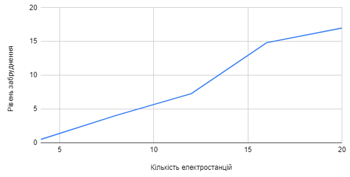
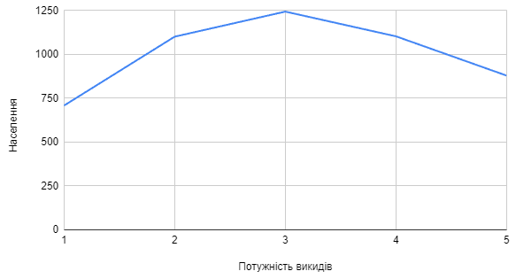
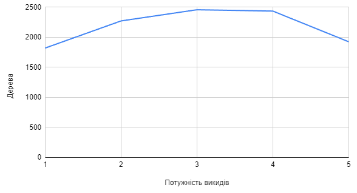

## Комп'ютерні системи імітаційного моделювання
## СПм-22-3, **Ботнар Павло Дмитрович**
### Лабораторна робота №**1**. Опис імітаційних моделей та проведення обчислювальних експериментів

 

### Варіант 4, модель у середовищі NetLogo:
[Urban Suite - Pollution](https://www.netlogoweb.org/launch#http://www.netlogoweb.org/assets/modelslib/Curricular%20Models/Urban%20Suite/Urban%20Suite%20-%20Pollution.nlogo)

 

### Вербальний опис моделі:
Забруднення повітря та боротьба з ним.
Ця модель є дослідженням крихкої рівноваги екосистеми хижак-жертва. Популяції людей, елементів ландшафту та зграї повітряних забруднювачів які конкурують за ресурси в замкнутому середовищі. Використовуючи цю модель, можна досліджувати поведінку популяцій протягом тривалого часу, коли вони динамічно взаємодіють: хижаків (забруднення) і здобич (людей) можна порівнювати протягом кількох поколінь, оскільки їхні популяції демонструють регулярний або нерегулярний репродуктивний успіх.
Регулярні коливання (цикли) чисельності популяції вказують на баланс і стабільність в екосистемі, де, незважаючи на коливання, популяції зберігаються протягом тривалого часу. І навпаки, нерегулярні коливання вказують на нестабільність, що веде до потенційного вимирання обох співзалежних популяцій. Модель встановлює негативну петлю зворотного зв’язку: хижаки гальмують щільність здобичі, а здобич стимулює щільність хижаків.

### Керуючі параметри:
- **initial-population** кількість людей, створених на початку запуску моделі.
- **birth-rate** шанси кожної людини створити потомство.
- **planting-rate** шанс з яким людина може висадити дерево щороку.
- **power-plants** кількість створених електростанцій.
- **polluting-rate** це потужність забруднення, яке виробляє кожна електростанція за рік.

### Внутрішні параметри:
- **people** кількість населення.
- **pollution** рівень забруднення.
- **trees** кількість дерев.

### Показники роботи системи:
- Кількість людей.
- Кількість дерев.
- Рівень забруднення

### Недоліки моделі:
- Немає механізму симуляції різних видів електростанцій(розмір, вид, стійкість к руйнуванню).
- Дерева мають бути здатні розмножуватися, щоб максимально відтворювати природні процеси.

 

## Обчислювальні експерименти
### 1. Вплив кількості електростанцій на рівень забруднення
Досліджується вплив кількості електростанцій на рівень забруднення протягом певної кількості років (25).
Експерименти проводяться при 2-10 електростанцій, з кроком 2, усього 5 симуляцій.  
Інші керуючі параметри мають значення за замовчуванням:
- **initial-population**: 100
- **birth-rate**: 0.1
- **planting-rate**: 0.05
- **polluting-rate**: 1

<table>
<thead>
<tr><th>Кількість електростанцій</th><th>Рівень забруднення</th></tr>
</thead>
<tbody>
<tr><td>2</td><td>6,445508903474649</td></tr>
<tr><td>4</td><td>8,047388790689803</td></tr>
<tr><td>6</td><td>16,094136862549135</td></tr>
<tr><td>8</td><td>22,566322774529564</td></tr>
<tr><td>10</td><td>29,87627613705905</td></tr>
</tbody>
</table>

Графік наочно показує, що збільшення кількості електростанцій прямопропорційно впливає на рівень забруднення середовища.

### 2. Вплив кількості електростанцій на рівень населення
Досліджується вплив кількості електростанцій на популяцію людей протягом певної кількості років (25).
Експерименти проводяться при 2-10 електростанцій, з кроком 2, усього 5 симуляцій.  
Інші керуючі параметри мають значення за замовчуванням:
- **initial-population**: 100
- **birth-rate**: 0.1
- **planting-rate**: 0.05
- **polluting-rate**: 1

<table>
<thead>
<tr><th>Кількість електростанцій</th><th>Населення</th></tr>
</thead>
<tbody>
<tr><td>2</td><td>501</td></tr>
<tr><td>4</td><td>548</td></tr>
<tr><td>6</td><td>592</td></tr>
<tr><td>8</td><td>557</td></tr>
<tr><td>10</td><td>517</td></tr>
</tbody>
</table>

Графік наочно показує, що збільшення кількості електростанцій понад шести вже негативно впливає на популяцію людей. Популяція перманентно знижується.

### 3. Вплив забруднення на кількість населення
Досліджується вплив потужності викидів забруднення на кількість населення протягом певної кількості років (25).
Експерименти проводяться при потужності забруднення кожної станції від 1-5, з кроком 1, усього 5 симуляцій.  
Інші керуючі параметри мають значення за замовчуванням:
- **initial-population**: 100
- **birth-rate**: 0.1
- **planting-rate**: 0.05
- **power-plants**: 5

<table>
<thead>
<tr><th>Потужність викидів</th><th>Населення</th></tr>
</thead>
<tbody>
<tr><td>1</td><td>450</td></tr>
<tr><td>2</td><td>575</td></tr>
<tr><td>3</td><td>449</td></tr>
<tr><td>4</td><td>417</td></tr>
<tr><td>5</td><td>400</td></tr>
</tbody>
</table>

Графік показує, що збільшення потужності викидів забруднення негативно впливає на популяцію людей. Популяція після рівня потужності 3, починає знижуватися.

### 4. Вплив забруднення на кількість дерев
Досліджується вплив потужності викидів забруднення на кількість дерев протягом певної кількості років (25).
Експерименти проводяться при потужності забруднення кожної станції від 1-5, з кроком 1, усього 5 симуляцій.  
Інші керуючі параметри мають значення за замовчуванням:
- **initial-population**: 100
- **birth-rate**: 0.1
- **planting-rate**: 0.05
- **power-plants**: 5

<table>
<thead>
<tr><th>Потужність викидів</th><th>Дерева</th></tr>
</thead>
<tbody>
<tr><td>1</td><td>279</td></tr>
<tr><td>2</td><td>384</td></tr>
<tr><td>3</td><td>319</td></tr>
<tr><td>4</td><td>297</td></tr>
<tr><td>5</td><td>249</td></tr>
</tbody>
</table>

Графік показує, що збільшення потужності викидів забруднення негативно впливає на кількість дерев. Кількість дерев після рівня потужності 3, починає знижуватися.
