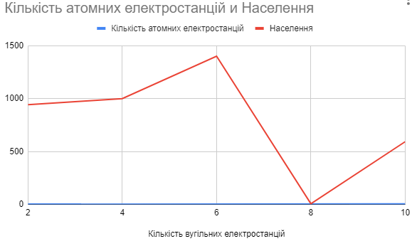
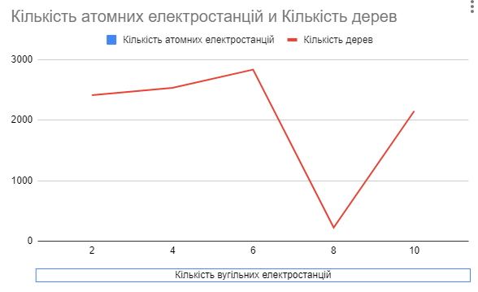
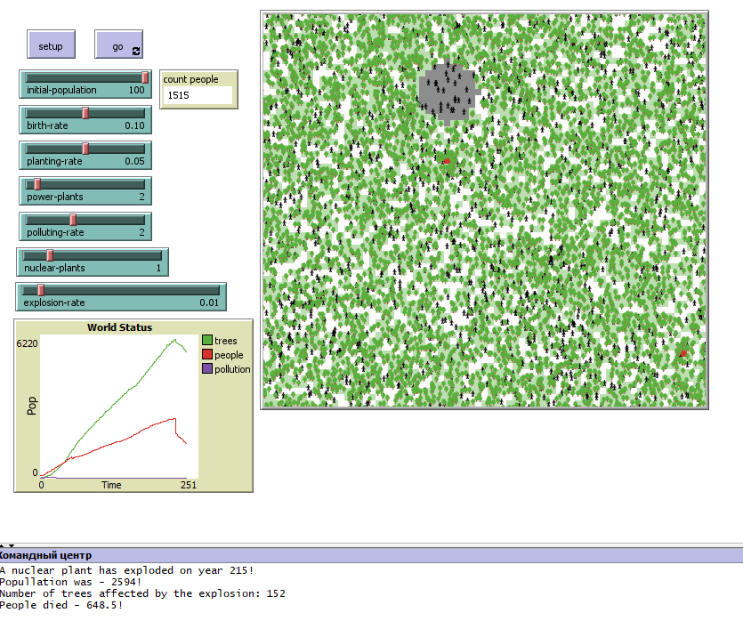

## Комп'ютерні системи імітаційного моделювання
## СПм-22-3, **Ботнар Павло Дмитрович**
### Лабораторна робота №**2**. Редагування імітаційних моделей у середовищі NetLogo

 

### Варіант 4, Вибрана модель у середовищі NetLogo:
[Urban Suite - Pollution](https://www.netlogoweb.org/launch#http://www.netlogoweb.org/assets/modelslib/Curricular%20Models/Urban%20Suite/Urban%20Suite%20-%20Pollution.nlogo)
 

### Вербальний опис моделі:
[1 Лабораторна робота](../lab1_var4/Lab1_var4.md)

### Внесені зміни у вихідну логіку моделі, за варіантом 4:
Реалізувати позитивний вплив наявності на імітаційному полі електростанцій на вірогідність появи нових людей. Збільшити вірогідність висадки дерев у клітинах поблизу електростанцій.

Змінилась функція **reproduce**
Перевірка чи не відбулося вибуху атомної станції чи він ще не був
Підвищується шанс розмноження людей біля будь-якої електростанції
<pre>
to reproduce  ; people reproduction procedure
  if ticks-since-explosion > 5 [ ; delay in reproduction after a nuclear explosion
    let reproduction-chance birth-rate
    if any? neighbors with [is-power-plant?] [
      set reproduction-chance reproduction-chance + 0.1 ; increase reproduction-chance near power plant in 10%
    ]
    if any? neighbors with [is-nuclear-plant?] [
      set reproduction-chance reproduction-chance + 0.2 ; increase reproduction-chance near nuclear plant in 20%
    ]
    if health > 4 and random-float 1 < reproduction-chance [
      hatch-people 1 [
        set health 5
      ]
    ]
  ]
end
</pre>

Змінилась функція **maybe-plant**
Перевірка чи теперішній патч не підірваний, і підвищується шанс саджання дерева біля будь-якої електростанції
<pre>
to maybe-plant  ; procedure determine chance to plant
  if not exploded? [
    let plant-chance planting-rate
    if any? neighbors with [is-power-plant?] [
      set plant-chance plant-chance + 0.15  ; increase plant-chance near power plant in 15%
    ]
    if any? neighbors with [is-nuclear-plant?] [
      set plant-chance plant-chance + 0.25  ; increase plant-chance near nuclear plant in 25%
    ]
    if random-float 1 < plant-chance [
      hatch-trees 1 [
        set health 5
        set color green
      ]
    ]
  ]
end
</pre>

### Внесені зміни у вихідну логіку моделі, на власний розсуд:
 Додано атомні електростанції що мають змогу вибухнути(шанс вибуху задається) і зменьшити кількість людей на чверть. Також після вибуху електростанції люди не можуть розмножуватися найближчі 5 років.
 Атомні електростанції не мають забруднення та сильніше 

Додавання нового патчу типу **is-nuclear-plant?** та **exploded?**
<pre>
patches-own [
  pollution
  is-power-plant?
  is-nuclear-plant? ; is patch nuclear plant
  exploded? ; is patch exploded after nuclear plant exploded
]
</pre>

Додавання нової глобал змінної **ticks-since-explosion** що допомагає порахувати час після останнього вибуху атомної станції
<pre>
globals [ticks-since-explosion] ; variable to determine time after nuclear explosion
</pre>

Додавання нової процедури для прорахування вибуху атомної станції **check-nuclear-explosion**
Під час вибуху чверть людей помирає, припиняє розмоножуватись перші 5 років, та гинуть всі дерева у радіусі 5 від станції.
<pre>
to check-nuclear-explosion ; procedure to simulare nuclear plant explosion killing some amout of people and trees, also restricts to reproduce people themself for 5 year after explosion
  ask patches with [is-nuclear-plant?] [
    if random-float 1 < explosion-rate [
      print (word "A nuclear plant has exploded on year " ticks "!")
      print (word  "Popullation was - " count people "!")
      let victims (count people) / 4
      ; kill a quarter of the current population
      ask n-of victims people [ die ]
      ; kill a all trees in radius
      let affected-trees count trees in-radius 5
      ; Print the number of affected trees
      print (word "Number of trees affected by the explosion: " affected-trees)
      ask trees in-radius 5 [ die ]
      ; mark the nuclear plant as destroyed
      set is-nuclear-plant? false
      set exploded? true
      ask patches in-radius 5 [
        set pcolor 5  ; Color makes patches in light gray
        set exploded? true  ; Mark makes patches as exploded
      ]
      print (word  "People died - " victims "!")
      set ticks-since-explosion 0
    ]
  ]
end
</pre>

## Обчислювальні експерименти
### 1. Вплив кількості вугільних та атомних електростанцій на рівень населення
Досліджується вплив кількості електростанцій на популяцію людей протягом певної кількості років (75).
Експерименти проводяться при 2-10 вугільних електростанцій з кроком 2 та 1-5 атомних електростанцій з кроком 1, усього 5 симуляцій.  
Інші керуючі параметри мають значення за замовчуванням:
- **initial-population**: 100
- **birth-rate**: 0.1
- **planting-rate**: 0.05
- **polluting-rate**: 2
- **explosion-rate**: 0.01

<table>
<thead>
<tr><th>Кількість вугільних електростанцій</th><th>Кількість атомних електростанцій</th><th>Населення</th></tr>
</thead>
<tbody>
<tr><td>2</td><td>1</td><td>943</td></tr>
<tr><td>4</td><td>2</td><td>1000</td></tr>
<tr><td>6</td><td>3</td><td>1401</td></tr>
<tr><td>8</td><td>4</td><td>6</td></tr>
<tr><td>10</td><td>5</td><td>593</td></tr>
</tbody>
</table>

 
Графік наочно показує, що збільшення кількості електростанцій вливає вже більш позитивно ніж негативно на ріст населення, але у разі вибуху аєс спричиняється катастрофічні наслідки для популяції людей.

### 2. Вплив кількості вугільних та атомних електростанцій на кількість дерев
Досліджується вплив кількості електростанцій на кількість дерев протягом певної кількості років (75).
Експерименти проводяться при 2-10 вугільних електростанцій з кроком 2 та 1-5 атомних електростанцій з кроком 1, усього 5 симуляцій.  
Інші керуючі параметри мають значення за замовчуванням:
- **initial-population**: 100
- **birth-rate**: 0.1
- **planting-rate**: 0.05
- **polluting-rate**: 2
- **explosion-rate**: 0.01

<table>
<thead>
<tr><th>Кількість вугільних електростанцій</th><th>Кількість атомних електростанцій</th><th>Кількість дерев</th></tr>
</thead>
<tbody>
<tr><td>2</td><td>1</td><td>2412</td></tr>
<tr><td>4</td><td>2</td><td>2532</td></tr>
<tr><td>6</td><td>3</td><td>2834</td></tr>
<tr><td>8</td><td>4</td><td>224</td></tr>
<tr><td>10</td><td>5</td><td>2150</td></tr>
</tbody>
</table>

 
Графік наочно показує, що збільшення кількості електростанцій в цілому впливає позитивно на збільшення кількості дерев. Але при вибуху атомних електростанцій кількість дерев значно зменьшується, бо вони одразу знщуються у радіусі станції

### Фінальний вид моделі
 

### Фінальний код моделі
<pre>
breed [ people person ]
breed [ trees tree ]
globals [ticks-since-explosion] ; variable to determine time after nuclear explosion

turtles-own [ health ]

patches-own [
  pollution
  is-power-plant?
  is-nuclear-plant? ; is patch nuclear plant
  exploded? ; is patch exploded after nuclear plant exploded
]

to setup
  clear-all
  set ticks-since-explosion 10 ; some number bigger than 5 to give possibiliy to reproducing people themselfs
  set-default-shape people "person"
  set-default-shape trees "tree"

  ask patches [
    set pollution 0
    set is-power-plant? false
    set exploded? false
    set is-nuclear-plant? false
  ]

  create-power-plants
  create-nuclear-plants ; creating nuclear plants
  ask patches [
    pollute
  ]

  create-people initial-population [
    set color black
    setxy random-pxcor random-pycor
    set health 5
  ]

  reset-ticks
end

to go

  if not any? people [ stop ]

  ask people [
    wander
    reproduce
    maybe-plant
    eat-pollution
    maybe-die
  ]

  diffuse pollution 0.8

  ask patches [
       pollute
  ]

  ask trees [
    cleanup
    maybe-die
  ]
  check-nuclear-explosion ; verify is nuclear plant not exploding
  set ticks-since-explosion ticks-since-explosion + 1 ; update exploding ticks it for case when nuclear plan is exploded
  tick
end

to create-power-plants
 ask n-of power-plants patches with [not is-nuclear-plant?] [
    set is-power-plant? true
     set pcolor red
  ]
end

to create-nuclear-plants
  ask n-of nuclear-plants patches with [not is-power-plant?] [
    set is-nuclear-plant? true
    set pcolor yellow
  ]
end

to pollute  ; pollution spreading procedure
  if is-power-plant? and not is-nuclear-plant? and not exploded? [
    set pcolor red
    set pollution polluting-rate
  ]
  if not is-nuclear-plant? and not is-power-plant? and not exploded? and pcolor != yellow [
      set pcolor scale-color red (pollution - .1) 5 0
  ]
end

to cleanup ; pollution decreasing procedure
  set pcolor green + 3
  set pollution max (list 0 (pollution - 1))
  ask neighbors [
    set pollution max (list 0 (pollution - .5))
  ]
  set health health - 0.1
end

to wander  ; people life light simulation procedure
  rt random-float 50
  lt random-float 50
  fd 1
  set health health - 0.1
end

to reproduce  ; people reproduction procedure
  if ticks-since-explosion > 5 [ ; delay in reproduction after a nuclear explosion
    let reproduction-chance birth-rate

    if any? neighbors with [is-power-plant?] [
      set reproduction-chance reproduction-chance + 0.1 ; increase reproduction-chance near power plant in 10%
    ]
    if any? neighbors with [is-nuclear-plant?] [
      set reproduction-chance reproduction-chance + 0.2 ; increase reproduction-chance near nuclear plant in 20%
    ]
    if health > 4 and random-float 1 < reproduction-chance [
      hatch-people 1 [
        set health 5
      ]
    ]
  ]
end

to maybe-plant ; procedure determine chance to plant
  if not exploded? [
    let plant-chance planting-rate
    if any? neighbors with [is-power-plant?] [
      set plant-chance plant-chance + 0.15  ; increase plant-chance near power plant in 15%
    ]
    if any? neighbors with [is-nuclear-plant?] [
      set plant-chance plant-chance + 0.25  ; increase plant-chance near nuclear plant in 25%
    ]
    if random-float 1 < plant-chance [
      hatch-trees 1 [
        set health 5
        set color green
      ]
    ]
  ]
end

to check-nuclear-explosion ; procedure to simulare nuclear plant explosion killing some amout of people and trees, also restricts to reproduce people themself for 5 year after explosion
  ask patches with [is-nuclear-plant?] [
    if random-float 1 < explosion-rate [
      print (word "A nuclear plant has exploded on year " ticks "!")
      print (word  "Popullation was - " count people "!")
      let victims (count people) / 4
      ; kill a quarter of the current population
      ask n-of victims people [ die ]
      ; kill a all trees in radius
      let affected-trees count trees in-radius 5
      ; Print the number of affected trees
      print (word "Number of trees affected by the explosion: " affected-trees)
      ask trees in-radius 5 [ die ]
      ; mark the nuclear plant as destroyed
      set is-nuclear-plant? false
      set exploded? true
      ask patches in-radius 5 [
        set pcolor 5  ; Color makes patches in light gray
        set exploded? true  ; Mark makes patches as exploded
      ]
      print (word  "People died - " victims "!")
      set ticks-since-explosion 0
    ]
  ]
end

to eat-pollution ; procedure decrease health affected by pollution
  if pollution > 0.5 [
    set health (health - (pollution / 10))
  ]
end

to maybe-die  ; die if you run out of health
  if health <= 0 [ die ]
end

; Copyright 2007 Uri Wilensky.
; See Info tab for full copyright and license.
</pre>

Фінальний код моделі та її інтерфейс доступні за [посиланням](lab4_pollution.nlogo).