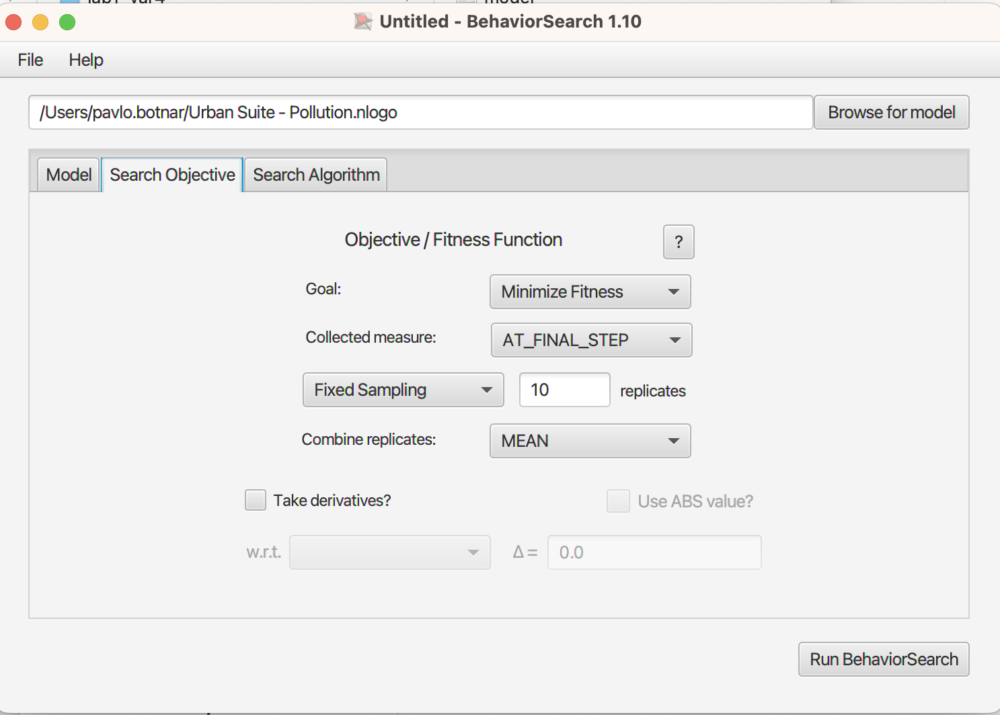

## Комп'ютерні системи імітаційного моделювання
## СПм-22-3, **Ботнар Павло Дмитрович**
### Лабораторна робота №**3**. Використання засобів обчислювального интелекту для оптимізації імітаційних моделей

 

### Варіант 4, модель у середовищі NetLogo:
[Urban Suite - Pollution](https://www.netlogoweb.org/launch#http://www.netlogoweb.org/assets/modelslib/Curricular%20Models/Urban%20Suite/Urban%20Suite%20-%20Pollution.nlogo)

 

### Вербальний опис моделі:
Забруднення повітря та боротьба з ним.
Ця модель є дослідженням крихкої рівноваги екосистеми хижак-жертва. Популяції людей, елементів ландшафту та зграї повітряних забруднювачів які конкурують за ресурси в замкнутому середовищі. Використовуючи цю модель, можна досліджувати поведінку популяцій протягом тривалого часу, коли вони динамічно взаємодіють: хижаків (забруднення) і здобич (людей) можна порівнювати протягом кількох поколінь, оскільки їхні популяції демонструють регулярний або нерегулярний репродуктивний успіх.
Регулярні коливання (цикли) чисельності популяції вказують на баланс і стабільність в екосистемі, де, незважаючи на коливання, популяції зберігаються протягом тривалого часу. І навпаки, нерегулярні коливання вказують на нестабільність, що веде до потенційного вимирання обох співзалежних популяцій. Модель встановлює негативну петлю зворотного зв’язку: хижаки гальмують щільність здобичі, а здобич стимулює щільність хижаків.

### Керуючі параметри:
- **initial-population** кількість людей, створених на початку запуску моделі.
- **birth-rate** шанси кожної людини створити потомство.
- **planting-rate** шанс з яким людина може висадити дерево щороку.
- **power-plants** кількість створених електростанцій.
- **polluting-rate** це потужність забруднення, яке виробляє кожна електростанція за рік.

### Внутрішні параметри:
- **people** кількість населення.
- **pollution** рівень забруднення.
- **trees** кількість дерев.

### Показники роботи системи:
- Кількість людей.
- Кількість дерев.
- Рівень забруднення

### Налаштування середовища BehaviorSearch:

**Обрана модель**:
<pre>
C:\Program Files\NetLogo 6.3.0\models\Sample Models\Social Science\Urban Suite - Pollution.nlogo
</pre>

**Параметри моделі** (вкладка Model):  
*Параметри та їх модливі діапазони були **автоматично** вилучені середовищем BehaviorSearch із вибраної імітаційної моделі, для цього є кнопка «Завантажити діапазони параметрів із інтерфейсу моделі»*:
<pre>
["power-plants" [1 1 20]]
["initial-population" 100]
["birth-rate" [0.01 0.01 0.1]]
["polluting-rate" [1 1 5]]
["planting-rate" [0.01 0.01 0.1]]
</pre>
*birth-rate максимальне значення було занижине, бо при більших значеннях розрахунки зависали.
Також підвищів мінімальни значення усіх параметрів, задля більш реалістичних розрахунків.*  

Використовувана **міра**:  
Для фітнес-функції *(вона ж функція пристосованості або цільова функція)* було обрано **значення середнього рівня забруднення**
Вказано у параметрі "**Measure**":
<pre>
mean [pollution] of patches 
</pre>

Середній ріаень забруднення враховується **в середньому** за весь період симуляції тривалістю, 200 тактів, починаючи з 0 такту симуляції.  
*Параметр "**Mesure if**" зі значення true, по суті, і означає, що враховуватимуться всі такти симуляції, а чи не частина їх.
Параметри "**Setup**" та "**Go**" вказують відповідні процедури ініціалізації та запуску в логіці моделі (зазвичай вони так і називаються). BehaviorSearch в процесі роботи, по суті, замість користувача запускає ці процедури.*  
Параметр зупинки за умовою ("**Stop if**") вказує щоб симуляція зупинился після 200 тіків.
Загальний вигляд вкладки налаштувань параметрів моделі:  

**Налаштування цільової функції** (вкладка Search Objective):  
Метою підбору параметрів імітаційної моделі, що описує екосистему забруднення повітря, є **мінімізація** значення середнього рівня забруднення – це вказано через параметр "**Goal**" зі значенням **Minimize Fitness**. Тобто необхідно визначити такі параметри налаштувань моделі, у при яких забруднення буде на мінімальному рівні. При цьому цікавить не просто середній рівень забруднення у якийсь окремий момент симуляції, а середне її значення за всю симуляцію (тривалість якої (200 кроків) вказувалася на минулій вкладці). Для цього у параметрі "**Collected measure**", що визначає спосіб обліку значень обраного показника, вказано **MEAN_ACROSS_STEPS**.  
Щоб уникнути викривлення результатів через випадкові значення, що використовуються в логіці самої імітаційної моделі, **кожна симуляція повторюється по 10 разів**, результуюче значення розраховується як **середнє арифметичне**.
Загальний вигляд вкладки налаштувань цільової функції:  

**Налаштування алгоритму пошуку** (вкладка Search Algorithm):  
*На цьому етапі було визначено модель, налаштовано її параметри (тобто вказано, які з них незмінні, а які в процесі пошуку можуть змінюватися і в яких діапазонах), і обрано міру, що лежить в основі функції пристосованості, що дозволяє оцінити якість кожного перевіряємого BehaviorSearch варіантів рішення.  
У ході дослідження на лабораторній роботі використовуються два алгоритми: Випадковий пошук(**RandomSearch**) і Простий генетичний алгоритм (**StandardGA**).  
Для цих алгоритмів, що вирішують завдання пошуку такого набору параметрів імітаційної моделі, щоб задовольнити вимоги користувача (у нашому випадку – мінімізувати значення середнього рівня забруднення у заданій імітаційній моделі), необхідно вказати "**Evaluation limit**" (число ітерацій пошуку, у разі ГА – це буде кількість поколінь), та "**Search Space Encoding Representation**" (спосіб кодування варіанта вирішення). Загальноприйнятого "кращого" способу кодування немає, треба куштувати, які підійдуть саме до вашої моделі.
Параметр "**Use fitness caching**" впливає лише на продуктивність.
Загальний вид вкладки налаштувань алгоритму пошуку:  

### Результати використання BehaviorSearch:
Результат пошуку параметрів імітаційної моделі, використовуючи **генетичний алгоритм**:  

Результат пошуку параметрів імітаційної моделі, використовуючи **випадковий пошук**:  

### Аналіз результатів:

**Кількість електростанцій**:
GA знайшов рішення з меншою кількістю електростанцій, що зазвичай призводить до меншого забруднення, але в цьому випадку з вищою нормою забруднення на станцію (polluting-rate = 4).
Random Search знайшов рішення з більшою кількістю електростанцій, але кожна станція має меншу норму забруднення (polluting-rate = 1).
**Рівень забруднення (polluting-rate)**:
Незважаючи на те, що GA має менше електростанцій, рівень забруднення на станцію значно вищий. Це може вказувати на те, що в моделі одна станція з високим рівнем забруднення може бути менш шкідливою, ніж багато станцій з низьким рівнем забруднення, або ж це може бути результатом динаміки взаємодії між електростанціями та деревами, які очищають повітря.
**Шанс посадки дерев (planting-rate)**:
GA обрав трохи вищій шанс посадки, можливо, компенсуючи вищий рівень забруднення від електростанції.
**Загальна пристосованість (Fitness)**:
Fitness результатів Random Search кращий, незважаючи на те, що він має більшу кількість електростанцій.